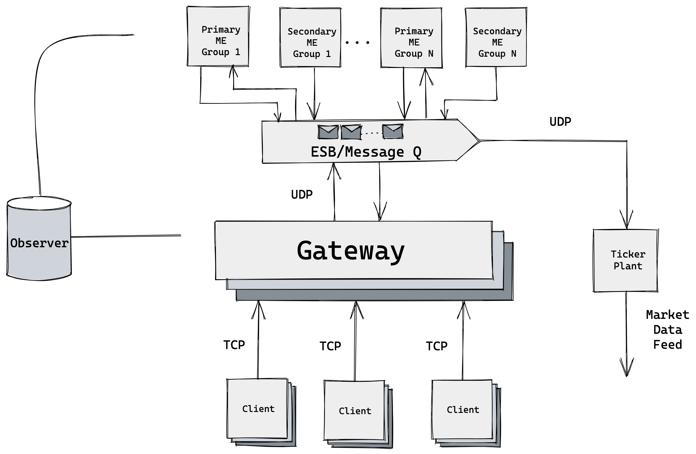

# Mini Exchange

## Week 9
Plan setup & architecture

## Week 10
Client & Gateway development

Client & Gateway: wonjong2

Order matching engine: wenyugu2

Tickerplant: yuduc2

## Week 11
Order matching engine development(cont.)  wenyugu2 

Client & Gateway: wonjong2

Tickerplant: yuduc2

## Week 12
Order matching engine development(cont.) wenyugu2

Client & Gateway integration test: wonjong2

ESB integration:  yuduc2, wenyugu2, wonjong2

Tickerplant: yuduc2

## Week 13
Order matching engine self & integration test: wenyugu2

Client & Gateway integration test: wonjong2

Ticker plant test: yuduc2

## Week 14
Debugging & testing: yuduc2, wenyugu2, wonjong2

Performance/stress test: yuduc2, wenyugu2, wonjong2

## Week 15
Final integration test
Hand in

## Technology
We plan to use Java as the main programming language and Docker to containerize each component. During testing, we could start a local cluster to simulate high request loads and test the system’s performance. For the ESB, we could use existing open-source tools such as Rabbitmq or Kafka.

## Development Environment

Daniel Gu: 
- Macbook Pro 16 i9 32G RAM 1T

Yudu Chen: 
- Macbook Pro 2021 
- Apple M1
- 16GB RAM
- 1T 
 

Jeff Shin: 
- ROG Zephyrus G14 GA401QM
- AMD Ryzen 9 5900HS
- 16 GB RAM
- Windows 11 (64 bit OS)
- 1T SSD

## Protocol for submitting orders/receiving updates
We can either follow standard FIX protocol or come up with a simplified version.
IEX FIX Spec

https://github.com/WojciechZankowski/iextrading4j-fix#description

Better binary protocol

https://github.com/real-logic/simple-binary-encoding

https://github.com/real-logic/aeron

## Client
A client sends order information to the gateway. We plan to implement two types of order: market order and limit order. A client can either send a request to place orders or cancel existing orders.  An order will include the price, type of order (ask or bid, limiting or market), quantity of an asset, order id, and client id. 

- A client will connect to a gateway and send orders via TCP connection in FIX format.
- A client will also receive notification from gateway regarding completion and cancellation (if an order is successfully canceled in ME) of an order, the customer will be notified regarding the order status.

## Gateway
The gateway functionality we have decided to implement in our project is as follows:
- Gateway is responsible for receiving orders from clients.
- It forwards the order request to the matching engines routed via the ESB.
- It validates client orders by some basic sanity checks such as whether the price is something that definitely cannot be filled

## ESB/Message Queue
Message Queue is basically a queue that routes order requests. 
- It distributes orders to different matching engines and receives order updates from the matching engine.
- It receives orders from and sends updated order status to the gateway.
- It sends the updated orderbook to the tickerplant.

## Order matching engine:
Order matching engine is responsible for finding the appropriate final price for the deal, complete orders matched, and remove orders upon receiving cancellation requests. 

## Limit Order
Hashmap + Balanced binary search tree (with parent pointer) + priority queue: 
The hashmap will take each limit price level as the key and point to nodes in the balanced binary search tree as the value. 

Another hashmap will take order ID as the key and each individual order as value. Whenever an order is canceled, the orders, maintained in the queue, can be accessed in constant time and removed from the queue.

The binary search search tree will maintain the order of nodes that correspond to different limit prices. At each limit price there is a priority queue for all the orders at that price level sorted by time. The tree will also maintain a parent pointer so that we can delete nodes in constant time given a pointer.

For each incoming limit order, we will start from the node that contains highest bid/lowest ask and traverse inorder until we fill the required volume

## Market Order
Similar to limit order, we start from the node that contains the highest bid/lowest ask and keep filling until volume is met.

## Ticker Plant:
The Ticker Plant receives market feed updates and distributes the market data feed (the updated order book) based on a pub/sub model. This part could either be implemented with Kafka or Rabbitmq. The data feed could follow IEX format.

## Evaluation Metric
We can evaluate the performance of the system by the following benchmarks.
End-to-end latency (second/orders)
Throughput (orders/second)
https://medium.com/@InternationalCryptox./matching-engine-tps-and-latency-metrics-from-the-incx-lab-1d4f19e60805

https://habr.com/en/post/581170/

## Testing
We plan to test the system by having multiple clients (~10-20) connected by using Vagrant and the system should scale well with reasonable latency. We can also stress test by sending large volume of trading orders at the same time from a single machine, eg. 500,000 orders/s

We can also use monitoring tools such as Grafana to provide real time metrics.

Throughput and latency test tool: https://github.com/openjdk/jmh
Stress testing tool: Jmeter

Integration test
-  Run the full pipeline and validate system states, eg. orderbook, order status

Unit test
- Matching engine, gateway, tickerplant, clients

