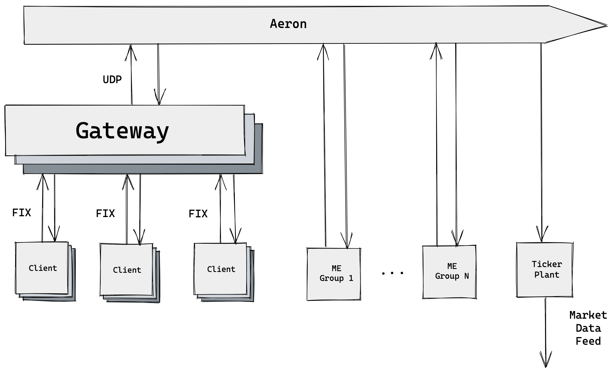

Mini Exchange Project Report
===
An Order Matching Engine, Gateway, and Tickerplant in Java SE 11

## Team Introduction

### Team Leader: Wenyu “Daniel” Gu (wenyugu2@illinois.edu)
Wenyu just received a Master's degree in Computer Science and also a B.S. in Computer Science with a minor in Mathematics at the University of Illinois at Urbana-Champaign in May 2022. He will join Bloomberg as a software engineer. He is passionate about both finance and technology. More specifically, he is interested in artificial intelligence (where he had worked on multiple projects in robotics, computer vision, etc) and software development (large scale data-intensive systems).

LinkedIn: [/in/wenyugu](https://www.linkedin.com/in/wenyugu/)

Github: [@wenyugu](https://github.com/wenyugu)


### Yudu Chen (yuduc2@illinois.edu)
Yudu is a Senior who just graduated from the University of Illinois at Urbana-Champaign in the Grainger college of engineering. He majors in Engineering Mechanics and minors in Computer Science. Yudu will be pursuing a Master's degree in Data Science at Columbia University in New York City. Yudu enjoys applying numerical analysis to engineering problems, programming in Java/Python, and database application development.

LinkedIn: [/in/yudu-chen-8b3352231](https://www.linkedin.com/in/yudu-chen-8b3352231/)

Github: [@semi-literatedengineeringstudent](https://github.com/semi-literatedengineeringstudent)

Gitlab: [@yuduc2](https://gitlab.engr.illinois.edu/yuduc2)


### Wonjong “Jeff” Shin (wonjong2@illinois.edu)
Wonjong (Jeff) is a current Sophomore at the University of Illinois at Urbana-Champaign studying Computer Science graduating in Spring 2024. During Summer 2022, Jeff will be working as a solution architect-engineer at Meissa, a Drone Data Platform with AI. Jeff enjoys programming in Java and Python, focusing on backend relational cloud database-centric web-based application development. 

LinkedIn: [/in/jeff-shin](https://www.linkedin.com/in/jeff-shin/)

Github: [@shinwj123](https://github.com/shinwj123)

Gitlab: [@wonjong2](https://gitlab.engr.illinois.edu/wonjong2)


## Project Description

This project is in fulfillment of **IE498 – High Frequency Trading** under the guidance of [Professor David Lariviere](https://davidl.web.illinois.edu/). The project involves creating a mini exchange using Java which consists of a gateway for order submission using [FIX](https://en.wikipedia.org/wiki/Financial_Information_eXchange) protocol, one/multiple order matching engine(s), and a tickerplant that publishes market data in [IEX DEEP](https://iextrading.com/docs/IEX%20DEEP%20Specification.pdf) format using UDP multicast and websocket to stream data for frontend visualization as well as a web-based dashboard that can visualize and analyze market data in real-time. Clients can establish a direct TCP connection to the gateway, send MARKET, LIMIT, or CANCEL orders, and receive order execution reports. The matching engines receive the orders, check to see if they match any resting orders on the book, and then send execution report messages that contain information about the order status and any changes in price levels to the gateway and tickerplant using UDP multicast. The tickerplant maintains and updates a separate set of orderbooks upon receiving messages from matching engines and publishes market data using IEX DEEP format.   

Testing in the project is done by both unit tests and end-to-end tests that make multiple connections to the gateway, send batch orders, and then validate those that should match. We also test whether the appropriate execution report messages are received at the gateway and whether the correct market data updates are published from the tickerplant.

## Technology Overview

### Java SE 11
The [Java](http://www.java.com) programming language is one of the general-purpose programming languages that global programmers use. Java SE 11 is one of the long-term support (LTS) versions of Java. Java SE 11 is used in the project due to unresolved security issues in older versions and the compatibility of systems that the Mini Exchange project is consisted of. 

### Maven
[Apache Maven](https://maven.apache.org/), a tool developed by Apache Software Foundation, is a build automation tool that is especially used for Java-based programming projects. Maven is also compatible with C#, Ruby, Scala, and other languages. Maven pom file elaborates how software is built, building orders, dependencies, and required plug-ins. Maven targets to provide an easy build process, a uniform build system, quality project information, and encouragement for better development. Due to those advantages, Maven is chosen for building the Mini Exchange project.

### Log4j
[Apache Log4j](https://logging.apache.org/log4j/2.x/), a logging framework developed by Apache Software Foundation, is one of several Java logging frameworks.  

In the Mini Exchange project, Log4j 2 is used since it is highly configurable through external configuration files at runtime. Loggers can be easily configured to pretty format log messages for debugging and filter out logs according to its levels in production. For example, we might only care about logs involving ERRORS while filtering all WARNING logs.

### TCP Connection
The Transmission Control Protocol (TCP) is one of the main protocols of the Internet protocol suite. The TCP is unicast and runs on top of the Internet Protocol (IP). It provides reliability, ordering, error-detection, flow control, and invisibility to the user. Major internet applications that rely on TCP are World Wide Web, email, remote administration, and file transfer.  

TCP is connection-oriented, and a connection between the client and server must be established before the data can be sent. Before the client attempts the connection, the server has to be passively opened. Then, a client establishes the connection by using a three-way handshake: SYN, SYN/ACK, ACK. During active open, the client sends SYN, the server replies with SYN/ACK, and the client sends an ACK back to the server. Due to the acknowledgment and retransmission of the TCP connection, it is commonly used in sending orders for all exchange or broker interfaces.  

The Financial Information eXchange (FIX) protocol over TCP is used in the project for clients to submit orders. FIX is chosen because it is a global information and data protocol used to message trade information among financial institutions. The detailed description of FIX is discussed in the next section. 

### FIX Protocol
The [Financial Information eXchange (FIX) protocol](https://www.fixtrading.org/what-is-fix/) is an open electronic communications protocol that provides the fundamentals in facilitating the international real-time exchange of information related to securities transactions and markets over the past decade. The FIX protocol is comprised of a series of messaging specifications and is designed to standardize electronic communications in the financial services industry supporting multiple formats and types of communications between financial entities, including trade allocation, order submissions, order changes, execution reporting, and advertisements. Originally developed to support equities trading in the pre-trade and trade environment, it is now experiencing rapid expansion into the post-trade space and other markets.  

The [QuickFIX/J protocol](https://www.quickfixj.org/) is chosen to be used in the Mini Exchange project. QuickFIX/J is a full-featured messaging engine for the FIX protocol. It is a 100% Java open-source implementation of the popular C++ QuickFIX engine and supports Java NIO asynchronous network communications for scalability and processing threading strategies. 

[FIX 4.2](https://www.fixtrading.org/standards/fix-4-2/), one of two most popular FIX protocol versions is selected for the project due to the wide range of its usage. Other versions can also be configured by using a different data dictionary file at the gateway. 

### UDP Connection
The User Datagram Protocol (UDP) is one of the main protocols of the Internet protocol suite. The UDP can be unicast, multicast, and broadcast. UDP provides the lowest latency among the internet protocol suite since UDP uses a simple connectionless communication model with a minimum of protocol mechanisms. Since UDP has no handshaking dialogues, it is not as reliable as TCP connections. Since UDP exposes the user’s program to the underlying network, delivery, ordering, or duplication protection is not guaranteed. Moreover, UDP is often used in time-sensitive applications due to avoid waiting for packets that are delayed due to retransmission and dropping packets. Fortunately, [Aeron](https://github.com/real-logic/aeron) has already taken care of these and provides a reliable messaging interface over UDP.  

Aeron is chosen to be used in the Mini Exchange project. According to the creator of Aeron, it is
> a messaging solution for efficient reliable UDP unicast, UDP multicast, and IPC message transport. 

### Aeron
[Aeron](https://github.com/real-logic/aeron) is an [OSI Layer 4 message transport protocol](https://en.wikipedia.org/wiki/OSI_model#Layer_4:_Transport_Layer) maintained by Real Logic for efficient, reliable UDP unicast, UDP multicast, and IPC message transport.  Aeron has the advantage of high bandwidth with low latency, reliability, flow control, and congestion control. Sending requests and receiving responses using Aeron needs two connections since Aeron uses unidirectional connections.  

Media Driver in Aeron handles all media-specific logic in use for any active publications or subscriptions. It consists of the Driver Conductor, Receiver, Sender, and Client Conductor. Media Driver has four options of threading modes: Dedicated, Shared Network, Shared, and Invoker. We used dedicated mode for the most performance benefit.  

In this Mini Exchange project, the Aeron messaging system is implemented in Java. Since Aeron provides easy-to-use and efficient and reliable UDP multicast, it is selected as the library to use for communication between gateway, order matching engine, and tickerplant. We also explored alternative messaging libraries such as Kafka. However, it does not provide means of sending messages via multicast which is essential for ensuring fairness in financial systems.

### Agrona
[Agrona](https://github.com/real-logic/agrona) is a library also maintained by Real Logic that provides efficient data structures and utility methods commonly deployed in high performance Java programs because it uses off-heap memory that is not subjected to garbage collection by the JVM. Various Agrona data structures were implemented in Aeron application, such as Agrona buffers and hashmap.

The Agrona buffer is used in our system to store information sent through Aeron stream channels because Aeron is designed to be used in conjunction with Agrona data structure.  The Agrona hashmap collection is used in both tickerplant and matching engine to handle stock symbols-to-orderbooks mapping. Its [boxing prevention](https://aeroncookbook.com/agrona/data-structures/) (Preventing conversion from a Java primitive type to its wrapper classes) is the reason why we chose it over Java hashmap.

### IEX Market Data (DEEP)
[IEX DEEP](https://iextrading.com/docs/IEX%20DEEP%20Specification.pdf) is the official format by the IEX to display changes in each price level, such as share quantity at price and update process status, in a binary format. The binary format facilitates messaging efficiency and is easy to parse compared to other market data formats such as FIX which is ASCII encoded. For those reasons, the team planned to have tickerplant multicasting price level update messages in IEX format to assigned subscribers, which is not included but can be easily added by incorporating another Aeron multicast publisher.  

### Vagrant
[Vagrant](https://www.vagrantup.com/) is software that is aimed at building and managing multiple virtual machine environments in a single system. Examples of the virtual machine environment that Vagrant could manage are VirtualBox, KVM, Hyper-V, Docker containers, VMware, and AWS. Vagrant has a benefit that increases development productivity by simplifying configuration management. Virtualization allows easy dependency management across different developers and easy scripting for DevOps.  

Due to those advantages, Vagrant is used for Mini Exchange to run the multiple clients, multiple order matching engines, gateway, and tickerplant each in a separate virtual machine environment.  

[Docker](https://www.docker.com/?utm_source=google&utm_medium=cpc&utm_campaign=search_na_brand&utm_term=docker_exact&utm_content=modern&gclid=CjwKCAjw7IeUBhBbEiwADhiEMYAjAqEfem8-p7_q9hNu6R-iUufXZjm6DFVFGQqBFtxgcZ-P2_L2bxoC878QAvD_BwE), the OS-level virtualization software to deliver software in containers, was also considered to use instead of VirtualBox.  Docker uses containers to create user defined environment to build a specific application, which is more light-weighted compared to the virtual machines. However, the team intends to simulate real world scenario where different components of the exchange is hosted in different machines. Therefore, virtual machines are used to run the entire application. In addition, Docker does not support multicast traffic over its bridged network which is the default networking mode among all containers. However, we can easily configure multicast in VMs by adding multicast addresses (typically in the form of 224.x.x.x) to the routing table.

### JUnit Testing
[JUnit](https://junit.org/junit4/javadoc/4.12/org/junit/Test.html) is a testing utility that facilitates writing methods specifically for testing the correctness of the behavior of java code. The team splits exchange components into multiple parts where each team member develops these parts separately until final integration. JUnit testing enables team members to write test cases specifically for their classes to ensure expected code behaviors before the integration.

### Websocket
In order for the visualization dashboard to receive streaming data, the tickerplant also keeps a websocket server that publishes the same information regarding price level updates and execution details by using [Java-Websocket](https://github.com/TooTallNate/Java-WebSocket).


### Perspective
[Perspective](https://github.com/finos/perspective) is an interactive visualization library and it is designed to handle visulizing big data set. Originally developed at J.P. Morgan and open-sourced through the [Fintech Open Source Foundation (FINOS)](https://www.finos.org), Perspective allows users to configure data visualization and analysis entirely on browser, or in Python and [Jupyterlab](https://jupyterlab.readthedocs.io/en/stable/). 

Perspective enables real-time visualization of streaming data by using Apache Arrow for fast data streaming. It maintains SQL-like tables that will be constantly updated and can be used at either the server-side or the client-side or both. We have used the client-server replicated setup because it allows better performance when multiple clients are connected to the same dashboard. 

In order for the market data published from the tickerplant to be properly handled by Perspective, we need to stream it using Websocket and therefore we also include a Websocket server in the tickerplant that stream orderbook update information in JSON for Perspective to process and visualize.

The primary motivation for choosing perspective as the orderbook visualization tool is that it is supported by [FINOS(Fintech Open Source Foundation)](https://www.finos.org) as a financial data visualization tool and is well-suited for our purpose. Its open-source nature makes our visualization interface code accessible by people in the financial field who are not professional programmers. Also, there are existing video tutorials and examples in [perspective github repo](https://github.com/finos/perspective) that facilitate users to learn how to use Perspective API quickly.

## Component



### Client

#### Description
The Client application (aka Trader) is used to send order to gateway via TCP in proper FIX format. They can send new order, market order and limit order, and order cancel request. Furthermore, multiple clients can connect to the same gateway via TCP connection in different FIX sessions. After submitting orders, clients will receive execution report from the gateway where they are informed about whether their trade is accepted, executed, canceled, or rejected.
#### Implementation
The session of the Client application is set up by configuration in the SessionSettings class and setting a Client class as the application. A socket initiator for the TCP connection is created based on the session settings. A client first logs on, establish a FIX session with the gateway socker acceptors, and submit orders. Then, the client will specify clOrdId for new order or cancel request for its own tracking purpose (e.g. client will submit cancel request by referring to the id of the order to be cancelled). Client application could also send the multiple orders by reading from a script containing order instructions on each line by using the ClientMessageParser class, which stores each single order in an ArrayList. ClientMessageParser class also classifies the String in to certain tag format of FIX.  
#### What could be improved
One of the aspects that needs to be improved for client was enabling the feature of users able to manual entering the trading order in the User Interface. Currently, users can change the textfile to enter the orders. However, this is not able to be done in the frontend user interface. 
Currently, the dashboard is connected with python-based AI client that sends FIX message to the gateway. For future expansion, the Client Application would be connected with the dashboard to be able to manually enter the trading order in the dashboard. This could be modifying server.py and index.js while connecting to client application.


### Gateway
#### Description
The Gateway application communicates with Client application and order matching engines. A gateway allows clients to submit orders to the exchange and receive updates regarding their orders and route the trade requests to the order matching engine that handles the specified instrument.
#### Implementation
The gateway is configured as a socket acceptor that establishes a new session for each connection from clients. Once receiving FIX requests from clients, the gateway then publishes the trade request message to the matching engine that is responsible for that specific instrument via an Aeron publication channel. Gateway will also perform fundamental order validation (e.g. whether the instrument is currently traded at the exchange, whether order type is valid, whether the cancel request is referring to an order that is never submitted for that client) and reject the order if invalid, and send the execution report back to the client containing order status and execution quantity and price if any. 

#### What could be improved
Currently, the gateway only allows connections from known client entities, i.e. those senderCompId that are included as a part of the configuration file. However, we could allow dynamic session that can allow the gateway to accept client IP addresses according to a specified pattern or users that exists in the User Table of the trading application.

### Order Matching Engine
#### Description
The order matching engine is a primary component of an exchange. It maintains an orderbook for every traded instrument at the exchange and try to match orders that are submitted by traders. An orderbook consists of all LIMIT orders that are not matched sorted in price and time priority, i.e. all bid orders are sorted ascendingly and all asks are sorted descendingly and if there are multiple orders at the same limit price, those submitted first will be matched first. There is a match if the bid price is greater than or equal to the ask price. If there are matches for an incoming order, then the orders that are matched against are removed from the orderbook if they are fully filled. If an order is partially filled, then that order's remaining quantity that is still open for matching is reduced by the filled quantity. Different order types are processed in different priorities. CANCEL orders are processed first followed by MARKET orders and finally LIMIT orders. MARKET orders don't have a specified price and will typically be matched at multiple price levels until their specified quantity is entirely filled. They can also be thought of a special case of LIMIT orders where the limit price for bid and ask are infinity and zero respectively.
#### Implementation
For fast matching, the orderbook must support constant time deletion since only order id will be specified in CANCEL request. In addition, a pointer to each price level must be maintained since we need to frequently add to the back of a queue of all existing orders for that price level when a new LIMIT order is added. We used LinkedHashmap as the queue for each price level since it maintains insertion orders and supports constant time deletion given key. Therefore, we use a Java TreeMap to maintain orders sorted by their limit prices and two additional hashmaps (orderId -> order and price -> pointer to the queue for that price level) for fast operations. Finally, after matching, execution reports containing the order status and price level changes will be sent by a UDP multicast message via Aeron to all gateways and tickerplant.
#### What could be improved
Unfortunately, Java Treemap is a Red-black tree implementation and does not expose TreeNode API publicly. Therefore, even though we provide the pointer to the tree node that contains the order, the remove operation will still take O(log n) where n is the number of price levels. For more efficient orderbook, we must implement a custom tree-based data structure that maintains pointers to ancestor nodes so that we could remove a node in constant time given a pointer. In addition, all matching for all symbols is processed in a single thread. Since orderbooks are independent of each other, the matching algorithm can be easily parallelized by using one thread per orderbook.


### Tickerplant
#### Description
The tickerplant is responsible for tracking the global state of each price level in the market upon receiving information from the order matching engine. The state information includes price, number of shares at that price level, timestamp when this price level is last updated, and the symbol of the stock. The full snapshot of the tickerplant is an level 2 orderbook where depth of the orderbook is shown, but information regarding specific order will not be displayed. Upon receiving messages from the matching engines, the tickerplant will update price levels on its own orderbooks and send price level update messages to all subscribers via multicast.
#### Implementation
The tickerplant is implemented as a String to Object HashMaps where each symbol is mapped into its corresponding tickerplant orderbook

The orderbooks at the tickerplant are implemented as a Java TreeMap where the key is price and the value is the size of all orders at that price level. The bid side treemap is sorted in descending order so the highest bid (best bid) is output as the first entry. The ask treemap is sorted in ascending order so the lowest ask (best ask) is output as the first entry.

The TreeMap update method is called when the tickerplant receives multicast messages from matching engines. After the update is completed, the tickerplant will send price level update messages as JSON to the tornado server that is responsible for updating tables used by Perspective through Java websocket which will then be used by our dashboard to update visualization plots.

#### What could be improved
The tickerplant maintains orderbooks for different stock symbols, and each orderbook contains two Java [TreeMaps](https://docs.oracle.com/javase/8/docs/api/java/util/TreeMap.html), one for the ask and one for the bid sides. The TreeMaps are maintained in a seperate class from the main orderbook class. The fact that individual side books are maintain in a separate class means more interclass interactions, which increases load during program execution. The orderbook class and side book class can potentially be integrated into one class to reduce call stacks during updates, enhancing the efficiency of per message price level update and information retrieval. 


### Dashboard

Dashboard provides an interactive visualization and analytics user interface using Perspective library where users can create different views (line plots, heatmaps, data grids, or custom elements) for the same stream of data and query them using SQL like manners. All data received from the dashboard is streamed through websocket. Our dashboad contains a websocket server and a javascript web client.

The server updates the orderbook table upon receiving JSON messages from the tickerplant and directly publishes them using its own tornado websocket server for Perspective to visualize. Note that currently the server is only acted as a relay between the tickerplant and the frontend but can be used to handle requests for additional websocket endpoints for order submission directly from the dashboard. 

The client mirrors the table from the server, format information, and display visualization in the frontend. The front end supports data filtering through user interaction with the interface. 


## Git Repository Layout


    group_03_project
    ├── Client                    
    │   ├── src/main/java        
    │   │     ├── Client.java                      # FIX Client Socket Initiator
    │   │     ├── ClientApp.java                   # FIX Client Main Entry
    │   │     └── ClientMessageParser.java         # Trade Message Parser
    │   │    
    │   └── pom.xml              
    │   
    ├── Gateway                    
    │   ├── src/main/java        
    │   │     ├── Gateway.java                     # FIX Gateway Socket Acceptor
    │   │     └── GatewayApp.java                  # FIX Gateway Main Entry
    │   │
    │   └── pom.xml 
    │
    ├── MatchingEngine                    
    │   ├── src/main/java        
    │   │     └──MatchingEngine.java               # Order Matching Engine
    │   │    
    │   └── pom.xml 
    │
    ├── MediaDriver                    
    │   ├── src/main/java        
    │   │     ├── AeronUtil.java                   
    │   │     ├── BasicMediaDriver.java            # Basic MD configuration
    │   │     ├── LowLatencyMediaDriver.java       # Low Latency MD configuration
    │   │     ├── Publisher.java                   # Wrapper Class for Publication
    │   │     └── Subscriber.java                  # Wrapper Class for Subscription
    │   │    
    │   └── pom.xml 
    │
    ├── OrderBook                    
    │   ├── src/main/java        
    │   │     ├── BookLevel.java
    │   │     ├── Order.java
    │   │     ├── OrderBook.java                   # Orderbook Data Structure
    │   │     ├── Report.java                      # Execution Report Published by ME
    │   │     └── TradeRequest.java                # Trade Request Message Sent by GW
    │   │
    │   └── src/test/java
    │         └── OrderBookTest.java    
    │
    ├── TickerPlant                    
    │   ├── src/main/java        
    │   │     ├── BookSide.java                    # Containers for BID & ASK OrderBooks
    │   │     ├── ByteDecoder.java                 # Byte -> Primitive Types
    │   │     ├── ByteEncoder.java                 # Primitive Types -> Byte
    │   │     ├── MessageFromME.java               # ME Message for Unit Testing
    │   │     ├── OrderBookTp.java                 # OrderBook at TP
    │   │     ├── PriceLevel.java                  
    │   │     ├── StockPrice.java                 
    │   │     ├── TPServer.java                    # WebSocket connecting TP and FrontEnd
    │   │     ├── TickerPlant.java                 # Update TickerPlant Orderbook
    │   │     └── toPriceLevelUpdateMessage.java   # IEX Byte -> String
    │   │    
    │   └── src/test/java
    │         ├── OrderBookTPTest.java             # Test Orderbook Update Logic 
    │         ├── PriceLevelTest.java              # Test Price Level Instantiation
    │         ├── PriceLevelUpdateMessageTest.java # Test IEX Decode/Encode
    │         └── StockPriceTest.java              # Test Stock Price Comparator
    │
    ├── dashboard  
    │   ├── initiator
    │   │     ├──order_scripts
    │   │     │          ├──test_scripts1.txt      # Order Submission Scripts
    │   │     │          └──test_scripts2.txt
    │   │     ├──spec
    │   │     │    ├──FIX42.xml                     # Different FIX Dictionaries
    │   │     │    └──...
    │   │     │     
    │   │     ├── application.py                   
    │   │     ├── client.py                        # FIX Dumb AI Trader in Python
    │   │     ├── client1.cfg
    │   │     ├── client2.cfg
    │   │     └── start.sh                         # Script to Launch Multiple Clients
    │   │
    │   ├── src 
    │   │     ├── client
    │   │     │     ├── index.html
    │   │     │     ├── index.js                   
    │   │     │     └──  index.less
    │   │     │      
    │   │     └── server                           
    │   │          ├──_init_.py
    │   │          └── server.py                   # Tornado Websocket Server
    │   │    
    │   ├── package.json            
    │   │                              
    │   ├── webpack.config.js
    │   │
    │   └── yarn.lock 
    │
    ├── scripts                    
    │   ├── client_install.sh            
    │   ├── install.sh
    │   ├── set_vagrant_env.sh
    │   └── start_all.sh
    │                   
    ├── Vagrantfile                    
    │
    └── pom.xml


The Exchange components are Client, Gateway, MatchingEngine, MediaDriver, OrderBook, TickerPlant, and dashboard. They are seperate directories at the root level of the repository. 

The scripts directory contains shell command to setup running applications and install all dependencies. 

The miscellaneous documents demonstrating high-level design concepts are also at the root of the repository.

The entire application is run on multiple separate virtual machines set up by the Vagrantfile on [VirtualBox](https://www.virtualbox.org/). Sufficient amount of RAM is required for running multiple VMs smoothing (at least 16G and 32G is recommended).


## Project Instruction
```bash=
# after git cloning
vagrant up # this might take up to 30 min since some dependencies have long build time such as quickfix-python
```
```bash=
# In another terminal
vagrant ssh matching-engine1
cd /vagrant && mvn -pl MatchingEngine -am clean package && java --add-opens java.base/sun.nio.ch=ALL-UNNAMED --add-opens jdk.unsupported/sun.misc=ALL-UNNAMED -jar MatchingEngine/target/MatchingEngine-1.0-SNAPSHOT-jar-with-dependencies.jar 192.168.0.51 1
```

```bash=
# In another terminal
vagrant ssh gateway
cd /vagrant && mvn -pl Gateway -am clean package && java --add-opens java.base/sun.nio.ch=ALL-UNNAMED --add-opens jdk.unsupported/sun.misc=ALL-UNNAMED -jar Gateway/target/Gateway-1.0-SNAPSHOT-jar-with-dependencies.jar 192.168.0.101 1
```

```bash=
# In another terminal
vagrant ssh tickerplant
cd /vagrant && mvn -pl TickerPlant -am clean package && java --add-opens java.base/sun.nio.ch=ALL-UNNAMED --add-opens jdk.unsupported/sun.misc=ALL-UNNAMED -jar TickerPlant/target/TickerPlant-1.0-SNAPSHOT-jar-with-dependencies.jar 192.168.0.201 1
```

```bash=
# In another terminal
vagrant ssh client
cd /vagrant && (sh initiator/start.sh 1 > /dev/null 2>&1 & yarn start)
```

Go to https://localhost:8080 to see the dashboard.

If using multiple matching engine, then after vagrant up
```bash=
# In another terminal
vagrant ssh matching-engine1
cd /vagrant && mvn -pl MatchingEngine -am clean package && java --add-opens java.base/sun.nio.ch=ALL-UNNAMED --add-opens jdk.unsupported/sun.misc=ALL-UNNAMED -jar MatchingEngine/target/MatchingEngine-1.0-SNAPSHOT-jar-with-dependencies.jar 192.168.0.51 1
```

```bash=
# In another terminal
vagrant ssh matching-engine2
cd /vagrant && mvn -pl MatchingEngine -am clean package && java --add-opens java.base/sun.nio.ch=ALL-UNNAMED --add-opens jdk.unsupported/sun.misc=ALL-UNNAMED -jar MatchingEngine/target/MatchingEngine-1.0-SNAPSHOT-jar-with-dependencies.jar 192.168.0.52 2
```

```bash=
# In another terminal
vagrant ssh gateway
cd /vagrant && mvn -pl Gateway -am clean package && java --add-opens java.base/sun.nio.ch=ALL-UNNAMED --add-opens jdk.unsupported/sun.misc=ALL-UNNAMED -jar Gateway/target/Gateway-1.0-SNAPSHOT-jar-with-dependencies.jar 192.168.0.101 1 2
```

```bash=
# In another terminal
vagrant ssh tickerplant
cd /vagrant && mvn -pl TickerPlant -am clean package && java --add-opens java.base/sun.nio.ch=ALL-UNNAMED --add-opens jdk.unsupported/sun.misc=ALL-UNNAMED -jar TickerPlant/target/TickerPlant-1.0-SNAPSHOT-jar-with-dependencies.jar 192.168.0.201 1 2
```

```bash=
# In another terminal
# If using order submission script and not using the dashboard
vagrant ssh client
cd /vagrant && python3.9 client.py client1.cfg -s order_scripts/test_script2.txt > /dev/null 2>&1 
```


## Testing

Integration test
- Due to time limits, integration test is currently only validated by manual inspection by sending orders in scripts and validate system states. Some helper methods are provided such as orderbook pretty formatter that can allow more human readable format.

Unit test
- Unit testing is carried out by using JUnit. Standard IDE such as Eclipse and Intellij IDEA have good support for this.
- For core components e.g. orderbooks, extensive unit tests cases are written involving checking the consistent state of orderbooks, such as checking if the total volume at a price level is equal to the sum of the volume of each individual orders on that level. Edge cases, such as empty orderbook, are also tested. 

## Result
The project is capable of establishing multiple client connections at gateway, submit orders either programmatically or in a order script, processing LIMIT, MARKET, and CANCEL orders at multiple matching engines, and publishing market data from tickerplant and finally using a web dashboard to visualize the state of the market.

## Example Output


In addition to the market data dashboard, we can also use wscat to inspect the market data that is streamed from the tickerplant by running the following command on the host machine.

```bash=
# install wscat if not already by
# npm install -g wscat
wscat --connect ws://localhost:8081
```


## Appendix

### Postmortem Summary

#### Wenyu "Daniel" Gu
1. What did you specifically do individually for this project?

   Implemented the matching engine, designed architecture, setup infrastructure and all pipelines (Vagrant provisioning, maven dependency management), provided utility classes for better encapsulation (Aeron Publisher and Subscriber, MediaDriver), finalized gateways functionalities and python FIX clients for auto trading and used Perspective to visualize market data. 

2. What did you learn as a result of doing your project?

   I learned industry-standard DevOps procedures, gained a deeper understanding of different networking stacks, improved skills of Linux system administration, and finally, I learned how to design and implement a financial exchange.

3. If you had a time machine and could go back to the beginning, what would you have done differently?

   I would start early on installing software dependencies and get the infrastructure running because some require a lot of time to configure properly, e.g. Maven.

4. If you were to continue working on this project, what would you continue to do to improve it, how, and why?
   
   The first thing to improve is to add inputs fields in the dashboard to allow users to enter orders directly in the browser and the user could select the symbol interested in trading and view the market dynamics for that symbol by applying some filters. Secondly, I would enable the matching engine to process each orderbook on a separate thread for better performance. Finally, I would incorporate thorough performance tests to test the system at its limit to gain an understanding of the efficiency of both the algorithm and the implementation.

5. What advice do you offer to future students taking this course and working on their semester-long project (besides “start earlier”... everyone ALWAYS says that). Providing detailed thoughtful advice to future students will be weighed heavily in evaluating your responses.

   Probably the most important piece of advice is to pick a team wisely. This could be done by either providing a better team matching process (mock team programming assignment) during the course or forming your own team before the semester starts. In this way, at least, you can have a pretty good understanding of how the team will function.

#### Yudu Chen
1. What did you specifically do individually for this project?

    During the project, my responsibility is to build the Tickerplant that updates the global state of stock price levels based on information from matching engine and have it send price level update message to frontend GUI through java websocket. 

2. What did you learn as a result of doing your project?

There are two aspects that I have learned from doing this project.
- Theoretical
Although using existing library itself does not involve understanding implementation detail of the library, having a good theoretical foundation in system programming and networking is crucial to help me learn using library fast. Due to lack of system programming knowledge, I had hard time reading aeron documentation and use aeron API flexibly. This compels me to learn knowledge about thread, process, networking such as UDP and TCP. Learning the necessity of low-level knowledge, I would imagine more low-level knowledge is required in making more performance-sensitive applications.
- Project Practice
  Though this could be a cliche, I really gained project experience unprecedented in previous CS classes. 

    The first thing required to be a good team member in a project is to have a good high-level overview of the business logic behind the project. Initially, my tickerplant logic was wrong not because I failed to implement programming logics I had in mind but that I misinterpret the overall functionality of the tickerplant in the project. Daniel corrected my understanding by showing me what the exchange should look like from the view of the Tickerplant. Knowing how each module interacts with other components is the necessary condition of correctly implementing my part in any project. Also, a proper understanding of componentwise interaction will aid simplifying structure of each section, facilitating future project maintenance. 
  
    The second thing is proper git practice to make project repository clean on both my local branch and remote branch. Initially, I was not aware of what should be ignored when commit local changes to git, and I even pushed my code to the main branch without knowing. (Daniel took a while to teach me how to revert) Working on the project really encourages me to further explore proper git practices and work on the project from a perspective of a maintainer rather than a student working on a for-grade assignment.
  
    The third thing is that I understand the necessity of quickly organizing fragmentized, abstract information such as API documentation. I understand this must be gained through more project experience and I still have much to learn.

3. If you had a time machine and could go back to the beginning, what would you have done differently?

    If I had a very powerful time machine, I would go back all the way to spring 2021 and take CS240 to guarantee the minimal experience working with networking. (Or tell the 16 years old myself to learn CS instead of focusing on economics and business school..)

    If I had a chance to go back to the first week, I would pick up things I have not learned from my CS theory classes as quickly as I can, such as docker, vagrant, shell command, etc... Those might not seem important, but they are the basic tools to ensure a stable and uniform working environment for every component in our application. This way I could have helped Daniel set up the environment and enable him to focus more on other parts. 

4. If you were to continue working on this project, what would you continue to do to improve it, how, and why?

    I will further reduce the complexity of the tickerplant, making the entire orderbook wrapped in a single class instead of 2 classes. Perhaps I will also have the tickerplant update record logged on a cloud database to track historical activities. Multicasting IEX byte encoded price level update message from Tickerplant to subscribers of the message is also a potential future expansion.  

5. What advice do you offer to future students taking this course and working on their semester-long project (besides “start earlier”... everyone ALWAYS says that). Providing detailed thoughtful advice to future students will be weighed heavily in evaluating your responses.

    Please be advised that this course involves good understanding of software project management, git practice, and potentially experience working with low-level system programming should your project be performance-sensitive. You can end up having a good project and a good grade should you do your best making your part of the project, but without good preparation you might feel guilty when you see your capable teammates making amazing things when you can barely make your own part works -- you will feel your team can make even a better project had you been a better programmer. Make sure you are prepared so that you will not compromise team work efficiency due to skill disparity.

#### Wonjong "Jeff" Shin
1. What did you specifically do individually for this project?

     My responsibility for the project is to build the Client Application and Gateway Application that uses TCP FIX protocol to communicate and implement the Aeron UDP protocol to communicate with Order Matching Engine.

    Moreover, I was in the significant organizer role of the Final Project Report, structuring the whole markdown report file with essentials and filling the detailed information.

2. What did you learn as a result of doing your project?

     I had an excellent education with getting an experience solely development experience. For developing Java-based Client and Gateway, there are about seven new skills/tools that I have experienced and deployed into the project. 
     
    The first two skills I learned were the TCP and UDP protocols. It took the longest to teach myself and learn about those two protocols. Also, using the internet protocol suite, it was such a great experience to introduce myself to how to implement the networking concepts to the project. Understanding and writing the configuration file was new, but I needed to experience some time in the programming journey. As a purpose of connecting multiple applications to multiple target applications (many-one, many-one relationship), better assignment of a specific port based on the application and its communication protocol was somewhat I learned how to plan it better out next time when I work on the networking-related project. 
    
    The third skill that I learned was Logging software. Since taking only introductory class, I was used to just doing assertions, throwing run time errors, etc. However, throughout the project, I got a chance to experience one of the most popular logging tools, Log4j, to log in the preferred format of messages for debugging purposes.
    
    The fourth skill that I learned was the Maven tool. I was unaware of how to create/handle Maven or Gradle since the course staff mainly takes it behind the scenes. This project exposed me to the Maven, one of the common ways to build the project structure. 
    
    The fifth skill that I learned was the Vagrant tool, one of the great software to manage multiple virtual environments simultaneously. Since the Vagrant tool is widely used, mainly at UIUC due to the course staff using it, I thought getting an exposure to understand what exactly the Vagrant does, deciding whether to implement it, and learning how to implement it was a great experience. I would be at a better start point for working on the Vagrant in the future.
    
    The sixth skill I learned was more team project-related skills than other skills. I learned how to have a better scope of understanding throughout the project while working as a part of the project. This is somewhat important to ensure that you do not leave the dedicated path the team has planned initially to go.

3. If you had a time machine and could go back to the beginning, what would you have done differently?

     I would have taken the course with more knowledge of computer science. Since working on the project with a background of elemental programming knowledge, it was challenging to teach me several programming concepts in a short period. The main struggle was teaching myself the networking knowledge and solely implementing the self-taught idea.
     
    I had often thought if I had already learned that knowledge in the classes that I would learn in the nearest future, I would have more time to dive deeper to create a more optimized and well-structured project for the course. Since deep-diving into the project, it would help me get exposed to more details of specific software or protocols (Vagrant, FIX, Aeron, etc.) and better understand them. Also, I could have finished my portion earlier to support those who need more help.  

4. If you were to continue working on this project, what would you continue to do to improve it, how, and why?

    If I could continue working on this project, I would first implement the feature that end-users could enter the trade order in the user interface and see the updates in the order book via the dashboard. Since Python is a relatively slow language with less control over underlying hardware, I would integrate the Java client via the Tornado server. This allows users actually to integrate with the project. 
    
    Also, connecting multiple gateways with 10~20 clients would be a great way to improve the project. I would modify the number of applications in the vagrant file and apply the proper modifications to scale up the project. 
    
    Finally, to make this project more user-likable, I would also work on pretty pictures / GUIs / user-friendly UI. I would work on [enhancing](https://www.bitmex.com/app/trade/XBTUSD) the frontend using Javascript to create a better user experience. 
    
5. What advice do you offer to future students taking this course and working on their semester-long project (besides “start earlier”... everyone ALWAYS says that). Providing detailed thoughtful advice to future students will be weighed heavily in evaluating your responses. 

    I would start from when the time of group matching, I think having a poll of indicating the strength of certain skillset (eg. Java - 5, Financial analysis - 3, Cloud DB - 6) for better teammate matching experience is needed. I liked the way how professor emphasized and focus on creating a good project design so the project does not got to the wrong direction. 
    
    While working on the team, a thorough evaluation of skill sets and reasonable work allocation is highly recommended. 
    
    During the weekly team meeting, I would recommend the team should talk details about teammate's progress and review their process/timeline often when they work on the project not to fall behind. Thus, putting a thorough evaluation of the technologies for the project is definitely recommended. 
    
    Finally, the potential of this course is maximized when the well-knowledged programmer works on the project since High Frequency Trading project recommends some networking related notion to focus on more optimization and better output.  


